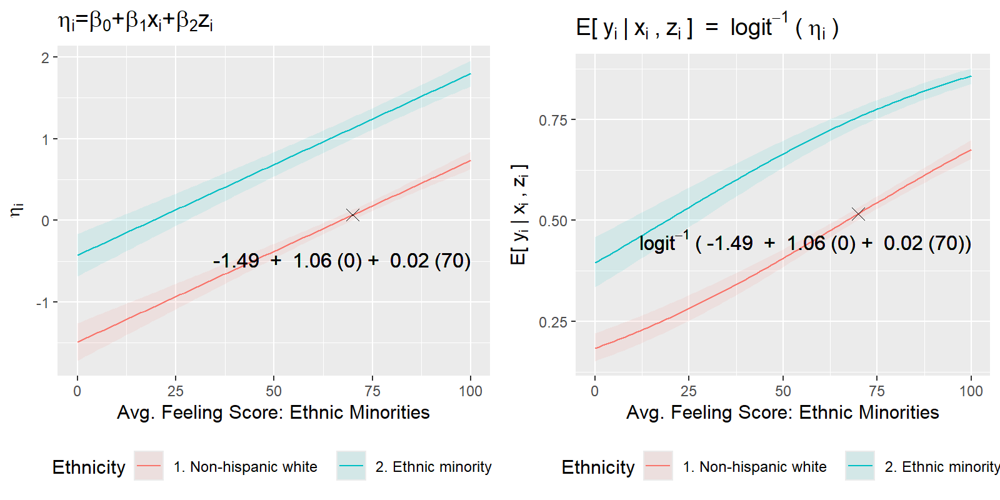
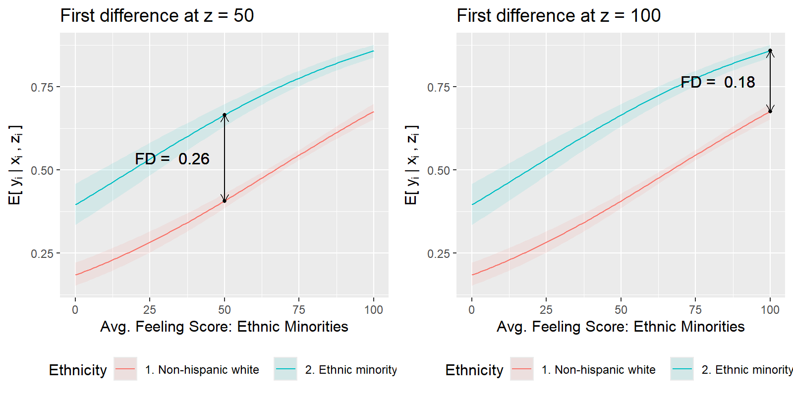
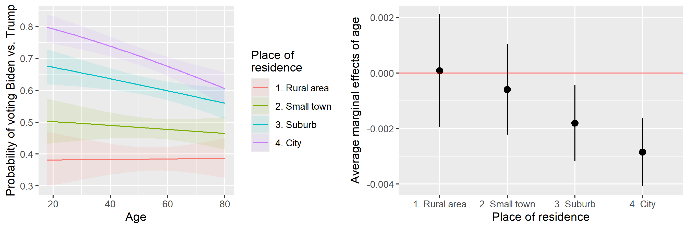
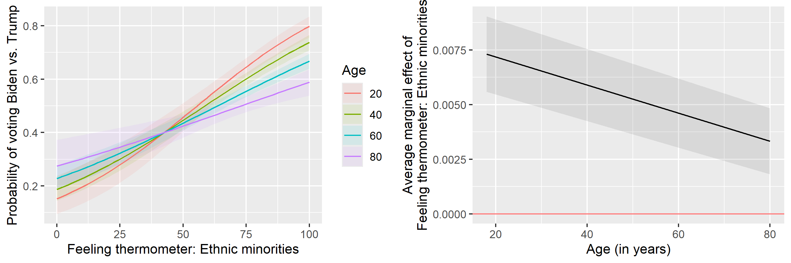

```{r, echo=FALSE, message = FALSE, warning = FALSE}
## --- Options ---
eval_ex <- TRUE
eval_sol <- TRUE
echo_sol <- FALSE
eval_learnr <- TRUE
eval_learnr_sol <- TRUE

knitr::opts_chunk$set(message = FALSE,
                      warning = FALSE)

## --- learnr ---
if ("learnr" %in% (.packages()))
  detach(package:learnr, unload = TRUE)
library(learnr)
```

```{r, echo=FALSE, context="server"}
## --- Options ---
eval_ex <- TRUE
eval_sol <- TRUE
eval_learnr <- TRUE
```

```{r setup, include=FALSE}
knitr::opts_chunk$set(echo = FALSE)

## ---- CRAN Packages ----
## Save package names as a vector of strings
pkgs <-  c("ggplot2",
           "dplyr",
           "tidyr",
           "viridis",
           "patchwork",
           "gridExtra")

## Install uninstalled packages
lapply(pkgs[!(pkgs %in% installed.packages())],
       install.packages,
       repos='http://cran.us.r-project.org')

## Load all packages to library and adjust options
lapply(pkgs, library, character.only = TRUE)
```

## Generalized linear models

### Goals for this session

- To understand generalized linear models (GLM) as a unified methodology for producing parameter estimates ([Gill 2001](https://www.researchgate.net/publication/235726158_Generalized_Linear_Models_A_Unified_Approach), [Gill and Torres 2019](https://us.sagepub.com/en-us/nam/generalized-linear-models/book257965)).
- To understand that all GLM produce two important, intuitive, and substantively meaningful quantities of interest that can be derived from the parameter estimates and the data ([King et al. 2000](https://gking.harvard.edu/files/gking/files/making.pdf)):
  1. Expected values (conditional expectations)
  1. Average marginal effects or first differences

### The three parts of every GLM

All generalized linear models have three characteristic parts:

#### Family

- The family stipulates a stochastic process that can plausibly generate an outcome $y$
- This means we choose a pdf or pmf for $y$ given some parameters: $y_i \sim \text{f}(\theta_i, \psi)$
- The choice usually depends on the distributional properties of $y$
- Aliases: data-generating process, generative model, likelihood function


#### Linear component

- A linear model $y_i^{\ast} = \mathbf{x}_i^{\prime} \beta + \epsilon_i$
- The goal of inference is the estimation of $\beta$
- From, this, we can derive our *systematic component* or *linear predictor*, $\eta_i = \mathbf{x}_i^{\prime} \beta$

#### Inverse link function

- A function that transforms the systematic component $\eta_i$ such that it represents a characteristic *parameter* $\theta_i$ of the family
- $\theta_i = g^{-1}(\eta_i)$

### In a nutshell

Putting it all together, a GLM is given by

$$y_i \sim \text{f}(\theta_i = g^{-1}(\mathbf{x}_i^{\prime} \beta), \psi)$$

where $\psi$ is an auxiliary parameter that will sometimes be estimated (e.g., $\sigma^2$ in the linear model) and sometimes be fixed.

### Link to quantities of interest

#### Expected values

$\theta_i = g^{-1}(\mathbf{x}_i^{\prime} \beta)$ gives the characteristic *location parameter* on the scale of the outcome, $y_i$.

This corresponds to what [King et al. (2000)](https://gking.harvard.edu/files/gking/files/making.pdf) call **expected values**, $\mathbb{E}[y_i | \mathbf{x}_i]$.

#### Predicted values

*Posterior predictions*, $y_i^{\text{rep}} \sim \text{f}(\theta_i, \psi)$, give model-based simulations of the outcome.

This corresponds to what [King et al. (2000)](https://gking.harvard.edu/files/gking/files/making.pdf) call **predicted values**.

### Example 1: The linear model

- While every GLM is a special case of the general framework, the linear model is arguably a *very* special case.
- Why? Because its link function is the *identity function*.
- This not only makes the notation easier, but also means that the $\beta$'s are *directly interpretable* on the scale of the outcome.

#### The three parts:

- Family: $$y_i \sim \text{N}(\mu_i, \sigma^2)$$
- Linear component: $$y_i = \underbrace{\mathbf{x}_i^{\prime} \beta}_{\mu_i} + \underbrace{\epsilon_i}_{\sim \text{N}(0, \sigma^2)}$$
- Inverse link function: $$\mu_i = \text{id}(\eta_i) = \eta_i$$

Thus, the linear model is given by

$$y_i \sim \text{N}(\mathbf{x}_i^{\prime} \beta, \sigma^2)$$
where both $\beta$ and $\sigma^2$ are being estimated.


### Visualization: Linear model

```{r linear-visualization, echo=FALSE, message=FALSE, warning=FALSE, out.width="100%", fig.width=15, fig.height=4.5}
set.seed(20260417L)

# Quasi-continuous predictor on a 0-10 scale
x_vals <- 0:10

# Positive effect in the linear model
alpha <- 1
beta  <- 0.6
sigma <- 0.9

plot_df <- tibble::tibble(
  x = x_vals,
  eta = alpha + beta * x,
  mu = eta
)

# Simulate continuous outcomes for the third panel
n_per_x <- 200

sim_df <- tidyr::expand_grid(
  x = x_vals,
  draw = seq_len(n_per_x)
) %>%
  dplyr::left_join(plot_df, by = "x") %>%
  dplyr::mutate(y = stats::rnorm(dplyr::n(), mean = mu, sd = sigma))

p1 <- ggplot2::ggplot(plot_df, ggplot2::aes(x = x, y = eta)) +
  ggplot2::geom_line(linewidth = 1.1, color = "black") +
  ggplot2::geom_point(size = 2.2, color = "black") +
  ggplot2::scale_x_continuous(breaks = 0:10) +
  ggplot2::labs(
    title = "Linear component",
    subtitle = expression(eta[i] == bold(x)[i]^minute * beta),
    x = "x",
    y = expression(eta[i])
  ) +
  ggplot2::theme_minimal(base_size = 12) +
  ggplot2::theme(
    plot.title = ggplot2::element_text(face = "bold"),
    panel.grid.minor = ggplot2::element_blank()
  )

p2 <- ggplot2::ggplot(plot_df, ggplot2::aes(x = x, y = mu)) +
  ggplot2::geom_line(linewidth = 1.1, color = "black") +
  ggplot2::geom_point(size = 2.2, color = "black") +
  ggplot2::scale_x_continuous(breaks = 0:10) +
  ggplot2::labs(
    title = "Expected value",
    subtitle = expression(E * "[" * y[i] * "|" * x * "]" ~ "=" ~ mu[i] ~ "=" ~ eta[i]),
    x = "x",
    y = expression(E * "[" * y[i] * "|" * x * "]")
  ) +
  ggplot2::theme_minimal(base_size = 12) +
  ggplot2::theme(
    plot.title = ggplot2::element_text(face = "bold"),
    panel.grid.minor = ggplot2::element_blank()
  )

p3 <- ggplot2::ggplot(sim_df, ggplot2::aes(x = factor(x), y = y, color = factor(x))) +
  ggplot2::geom_jitter(width = 0.18, height = 0, alpha = 0.4, size = 1.2, show.legend = FALSE) +
  ggplot2::stat_summary(
    fun = mean,
    geom = "point",
    color = "black",
    fill = "white",
    shape = 21,
    size = 2.4,
    stroke = 0.7
  ) +
  ggplot2::scale_color_viridis_d(option = "D", begin = 0.15, end = 0.85) +
  ggplot2::labs(
    title = "Predicted value",
    subtitle = expression(y[i]^{"rep"} %~% Normal(mu[i], sigma^2)),
    x = "x",
    y = "y"
  ) +
  ggplot2::theme_minimal(base_size = 12) +
  ggplot2::theme(
    plot.title = ggplot2::element_text(face = "bold"),
    panel.grid.minor = ggplot2::element_blank()
  )

if (requireNamespace("patchwork", quietly = TRUE)) {
  p1 + p2 + p3
} else if (requireNamespace("gridExtra", quietly = TRUE)) {
  gridExtra::grid.arrange(p1, p2, p3, nrow = 1)
} else {
  print(p1)
  print(p2)
  print(p3)
}
```

### Example 2: The probit model

The probit model is a popular choice for modeling binary choices.

#### The three parts:

- Family: $$y_i \sim \text{Bernoulli}(\pi_i)$$
- Linear component: $$y_i^{\ast} = \underbrace{\mathbf{x}_i^{\prime} \beta}_{\eta_i} + \underbrace{\epsilon_i}_{\sim \text{N}(0, 1)}$$
- Inverse link function: $$\pi_i = \Phi(\eta_i)$$

Thus, the probit model is given by

$$y_i \sim \text{Bernoulli}(\Phi(\mathbf{x}_i^{\prime} \beta))$$

where the $\beta$ vector is being estimated. $\Phi$ is the standard normal CDF. Note that the standard normal CDF follows from fixing the variance of the error term, $\epsilon \sim \text{N}(0, 1)$.

### Example 3: The logit model

With a slight change in the error distribution in the linear component and a corresponding change in the inverse link function, we can derive the logit model for binary choices.

#### The three parts:

- Family: $$y_i \sim \text{Bernoulli}(\pi_i)$$
- Linear component: $$y_i^{\ast} = \underbrace{\mathbf{x}_i^{\prime} \beta}_{\eta_i} + \underbrace{\epsilon_i}_{\sim \text{Logistic}(0, 1)}$$
- Inverse link function: $$\pi_i = \frac{\exp(\eta_i)}{1 + \exp(\eta_i)}$$

Thus, the logit model is given by

$$y_i \sim \text{Bernoulli}\left(\frac{\exp(\eta_i)}{1 + \exp(\eta_i)}\right)$$

where the $\beta$ vector is being estimated. $\frac{\exp(\cdot)}{1 + \exp(\cdot)}$ is the standard logistic CDF. Shorthand: $\Lambda(\cdot)$.

As you can see, the *assumed* distribution of the error term on the latent variable $y_i^{\ast}$ dictates our choice of the inverse link function.

As the error distribution is fixed and its parameters are not being estimated, it is not in itself of substantive interest.

### Visualization: Logit model

```{r logit-visualization, echo=FALSE, message=FALSE, warning=FALSE, out.width="100%", fig.width=15, fig.height=4.5}
set.seed(20260417L)

# Quasi-continuous predictor on a 0-10 scale
x_vals <- 0:10

# Positive effect in the logit model
alpha <- -3
beta  <- 0.6

plot_df <- tibble::tibble(
  x = x_vals,
  eta = alpha + beta * x,
  p = stats::plogis(eta)
)

# Simulate binary outcomes for the third panel
n_per_x <- 200

sim_df <- tidyr::expand_grid(
  x = x_vals,
  draw = seq_len(n_per_x)
) %>%
  dplyr::left_join(plot_df, by = "x") %>%
  dplyr::mutate(y = stats::rbinom(dplyr::n(), size = 1, prob = p))

bar_df <- sim_df %>%
  dplyr::count(x, y) %>%
  dplyr::group_by(x) %>%
  dplyr::mutate(prop = n / sum(n)) %>%
  dplyr::ungroup() %>%
  dplyr::mutate(y = factor(y, levels = c(0, 1), labels = c("0", "1")))

p1 <- ggplot2::ggplot(plot_df, ggplot2::aes(x = x, y = eta)) +
  ggplot2::geom_line(linewidth = 1.1, color = "black") +
  ggplot2::geom_point(size = 2.2, color = "black") +
  ggplot2::scale_x_continuous(breaks = 0:10) +
  ggplot2::labs(
    title = "Linear component",
    subtitle = expression(eta[i] == bold(x)[i]^minute * beta),
    x = "x",
    y = expression(eta[i])
  ) +
  ggplot2::theme_minimal(base_size = 12) +
  ggplot2::theme(
    plot.title = ggplot2::element_text(face = "bold"),
    panel.grid.minor = ggplot2::element_blank()
  )

p2 <- ggplot2::ggplot(plot_df, ggplot2::aes(x = x, y = p)) +
  ggplot2::geom_line(linewidth = 1.1, color = "black") +
  ggplot2::geom_point(size = 2.2, color = "black") +
  ggplot2::scale_x_continuous(breaks = 0:10) +
  ggplot2::scale_y_continuous(limits = c(0, 1)) +
  ggplot2::labs(
    title = "Expected value",
    subtitle = expression(E * "[" * y[i] * "|" * x * "]" ~ "=" ~ pi[i] ~ "=" ~ frac(exp(eta[i]), 1 + exp(eta[i]))),
    x = "x",
    y = expression(E * "[" * y[i] * "|" * x * "]")
  ) +
  ggplot2::theme_minimal(base_size = 12) +
  ggplot2::theme(
    plot.title = ggplot2::element_text(face = "bold"),
    panel.grid.minor = ggplot2::element_blank()
  )

p3 <- ggplot2::ggplot(bar_df, ggplot2::aes(x = factor(x), y = prop, fill = y)) +
  ggplot2::geom_col(width = 0.8) +
  ggplot2::scale_fill_viridis_d(option = "D", begin = 0.15, end = 0.85) +
  ggplot2::scale_y_continuous(limits = c(0, 1)) +
  ggplot2::labs(
    title = "Predicted value",
    subtitle = expression(y[i]^{"rep"} %~% Bernoulli(pi[i])),
    x = "x",
    y = "proportion",
    fill = NULL
  ) +
  ggplot2::theme_minimal(base_size = 12) +
  ggplot2::theme(
    plot.title = ggplot2::element_text(face = "bold"),
    panel.grid.minor = ggplot2::element_blank(),
    legend.position = "top"
  )

if (requireNamespace("patchwork", quietly = TRUE)) {
  p1 + p2 + p3
} else if (requireNamespace("gridExtra", quietly = TRUE)) {
  gridExtra::grid.arrange(p1, p2, p3, nrow = 1)
} else {
  print(p1)
  print(p2)
  print(p3)
}
```

## GLM Typology

### Single-family models

We will first focus on models whose likelihood function follows a single pdf or pmf.

### Univariate $\eta_i$, univariate $\theta_i$

Among the simplest GLM are those models that require

- a single family
- a univariate observation-specific systematic component $\eta_i$
- a univariate observation-specific location parameter $\theta_i$

Examples include the three models discussed above:

- The linear model ($\eta_i = \mu_i$)
- The probit model ($\eta_i = \mathbf{x}_i^{\prime}\beta$, $\pi_i = \Phi(\eta_i)$)
- The logit model ($\eta_i = \mathbf{x}_i^{\prime}\beta$, $\pi_i = \Lambda(\eta_i)$)

An additional example would be the *Poisson model* for counts:

- $y_i \sim \text{Poisson}(\lambda_i = \exp(\mathbf{x}_i^{\prime}\beta))$

### Visualization: Poisson model

```{r poisson-visualization, echo=FALSE, message=FALSE, warning=FALSE, out.width="100%", fig.width=15, fig.height=4.5}
set.seed(20260417L)

# Quasi-continuous predictor on a 0-10 scale
x_vals <- 0:10

# Positive effect in the Poisson model
alpha <- 0.2
beta  <- 0.25

plot_df <- tibble::tibble(
  x = x_vals,
  eta = alpha + beta * x,
  lambda = exp(eta)
)

# Simulate count outcomes for the third panel
n_per_x <- 200

sim_df <- tidyr::expand_grid(
  x = x_vals,
  draw = seq_len(n_per_x)
) %>%
  dplyr::left_join(plot_df, by = "x") %>%
  dplyr::mutate(y = stats::rpois(dplyr::n(), lambda = lambda))

p1 <- ggplot2::ggplot(plot_df, ggplot2::aes(x = x, y = eta)) +
  ggplot2::geom_line(linewidth = 1.1, color = "black") +
  ggplot2::geom_point(size = 2.2, color = "black") +
  ggplot2::scale_x_continuous(breaks = 0:10) +
  ggplot2::labs(
    title = "Linear component",
    subtitle = expression(eta[i] == bold(x)[i]^minute * beta),
    x = "x",
    y = expression(eta[i])
  ) +
  ggplot2::theme_minimal(base_size = 12) +
  ggplot2::theme(
    plot.title = ggplot2::element_text(face = "bold"),
    panel.grid.minor = ggplot2::element_blank()
  )

p2 <- ggplot2::ggplot(plot_df, ggplot2::aes(x = x, y = lambda)) +
  ggplot2::geom_line(linewidth = 1.1, color = "black") +
  ggplot2::geom_point(size = 2.2, color = "black") +
  ggplot2::scale_x_continuous(breaks = 0:10) +
  ggplot2::labs(
    title = "Expected value",
    subtitle = expression(E * "[" * y[i] * "|" * x * "]" ~ "=" ~ lambda[i] ~ "=" ~ exp(eta[i])),
    x = "x",
    y = expression(E * "[" * y[i] * "|" * x * "]")
  ) +
  ggplot2::theme_minimal(base_size = 12) +
  ggplot2::theme(
    plot.title = ggplot2::element_text(face = "bold"),
    panel.grid.minor = ggplot2::element_blank()
  )

p3 <- ggplot2::ggplot(sim_df, ggplot2::aes(x = factor(x), y = y, color = factor(x))) +
  ggplot2::geom_jitter(width = 0.18, height = 0, alpha = 0.4, size = 1.2, show.legend = FALSE) +
  ggplot2::stat_summary(
    fun = mean,
    geom = "point",
    color = "black",
    fill = "white",
    shape = 21,
    size = 2.4,
    stroke = 0.7
  ) +
  ggplot2::scale_color_viridis_d(option = "D", begin = 0.15, end = 0.85) +
  ggplot2::labs(
    title = "Predicted value",
    subtitle = expression(y[i]^{"rep"} %~% Poisson(lambda[i])),
    x = "x",
    y = "y"
  ) +
  ggplot2::theme_minimal(base_size = 12) +
  ggplot2::theme(
    plot.title = ggplot2::element_text(face = "bold"),
    panel.grid.minor = ggplot2::element_blank()
  )

if (requireNamespace("patchwork", quietly = TRUE)) {
  p1 + p2 + p3
} else if (requireNamespace("gridExtra", quietly = TRUE)) {
  gridExtra::grid.arrange(p1, p2, p3, nrow = 1)
} else {
  print(p1)
  print(p2)
  print(p3)
}
```


### Univariate $\eta_i$, multivariate $\theta_i$

Things get a bit more intricate when we model multivariate outcomes, e.g., discrete choice across multiple categories.

Multi-categorical discrete choice outcomes typically require that we stipulate a *categorical distribution* which requires choice-specific probability parameters $\theta_{ij} = \Pr(Y_i = j)$.

Thus, $\mathbf{\theta}_i$ is a length-$J$ vector for each $i=1,..,N$: $\mathbf{\theta}_i = \begin{bmatrix} \theta_{i1} & \dots & \theta_{iJ}\end{bmatrix}^{\prime}$, where $\sum_{j=1}^{J} \theta_{ij} = 1$ for each $i=1,..,N$. 

A model that accommodates this while using a single univariate linear predictor $\eta_i$ is the *ordered logit model*, which can be used for modeling ordered outcomes with $J$ categories.

#### Family

$$y_{ij} \sim \text{Categorical}(\theta_{ij})$$

#### Systematic component

The linear predictor is $\eta_i = \mathbf{x}_i^{\prime}\beta$, where $\beta$ does *not* include an intercept and $\mathbf{x}_i^{\prime}$ does not include a leading one.

In place of an intercept, the model produces $J-1$ ordered threshold parameters $\kappa$.

#### Link function 

We then use the inverse logit link function to retrieve $J$ probabilities $\theta_{ij}$ that $\eta_i$ falls between two adjacent thresholds $\kappa$:

$$\begin{split}\Pr(y_i = j | \mathbf{x}_i) & =\Pr(\kappa_{j-1} < y_i^\ast \leq \kappa_j) \\ & =\Lambda (\kappa_j - \eta_i) - \Lambda (\kappa_{j-1} - \eta_i)\end{split}$$

### Visualization: Ordered logit model

```{r ordered-logit-visualization, echo=FALSE, message=FALSE, warning=FALSE, out.width="100%", fig.width=15, fig.height=4.8}
set.seed(20260417L)

# Quasi-continuous predictor on a 0-10 scale
x_vals <- 0:10

# Positive effect in the ordered logit model
alpha <- -3
beta  <- 0.6

# Ordered-logit thresholds for 4 categories
kappa_1 <- -1.5
kappa_2 <- 0
kappa_3 <- 1.5

plot_df <- tibble::tibble(
  x = x_vals,
  eta = alpha + beta * x
) %>%
  dplyr::mutate(
    p1 = stats::plogis(kappa_1 - eta),
    p2 = stats::plogis(kappa_2 - eta) - stats::plogis(kappa_1 - eta),
    p3 = stats::plogis(kappa_3 - eta) - stats::plogis(kappa_2 - eta),
    p4 = 1 - stats::plogis(kappa_3 - eta)
  )

prob_df <- plot_df %>%
  dplyr::select(x, p1, p2, p3, p4) %>%
  tidyr::pivot_longer(
    cols = c(p1, p2, p3, p4),
    names_to = "category",
    values_to = "prob"
  ) %>%
  dplyr::mutate(
    category = factor(
      category,
      levels = c("p1", "p2", "p3", "p4"),
      labels = c("1", "2", "3", "4")
    )
  )

# Simulate ordered outcomes for the third panel
n_per_x <- 200

sim_df <- tidyr::expand_grid(
  x = x_vals,
  draw = seq_len(n_per_x)
) %>%
  dplyr::left_join(plot_df, by = "x") %>%
  dplyr::rowwise() %>%
  dplyr::mutate(
    y = sample.int(4, size = 1, prob = c(p1, p2, p3, p4))
  ) %>%
  dplyr::ungroup() %>%
  dplyr::mutate(
    y = factor(y, levels = 1:4, labels = c("1", "2", "3", "4"), ordered = TRUE)
  )

bar_df <- sim_df %>%
  dplyr::count(x, y) %>%
  dplyr::group_by(x) %>%
  dplyr::mutate(prop = n / sum(n)) %>%
  dplyr::ungroup()

cat_colors <- viridis::viridis(4, option = "D", begin = 0.15, end = 0.9)

p1 <- ggplot2::ggplot(plot_df, ggplot2::aes(x = x, y = eta)) +
  ggplot2::geom_hline(
    yintercept = c(kappa_1, kappa_2, kappa_3),
    color = "gray60",
    linewidth = 0.7,
    linetype = "dashed"
  ) +
  ggplot2::annotate(
    "text",
    x = 9.8,
    y = kappa_1 + 0.08,
    label = expression(kappa[1] * ": 1 | 2"),
    hjust = 1,
    vjust = -0.2,
    color = "gray40",
    size = 3.6
  ) +
  ggplot2::annotate(
    "text",
    x = 9.8,
    y = kappa_2 + 0.08,
    label = expression(kappa[2] * ": 2 | 3"),
    hjust = 1,
    vjust = -0.2,
    color = "gray40",
    size = 3.6
  ) +
  ggplot2::annotate(
    "text",
    x = 9.8,
    y = kappa_3 + 0.08,
    label = expression(kappa[3] * ": 3 | 4"),
    hjust = 1,
    vjust = -0.2,
    color = "gray40",
    size = 3.6
  ) +
  ggplot2::geom_line(linewidth = 1.1, color = "black") +
  ggplot2::geom_point(size = 2.2, color = "black") +
  ggplot2::scale_x_continuous(breaks = 0:10) +
  ggplot2::labs(
    title = "Linear component",
    subtitle = expression(eta[i] == bold(x)[i]^minute * beta),
    x = "x",
    y = expression(eta[i])
  ) +
  ggplot2::theme_minimal(base_size = 12) +
  ggplot2::theme(
    plot.title = ggplot2::element_text(face = "bold"),
    panel.grid.minor = ggplot2::element_blank()
  )

p2 <- ggplot2::ggplot(prob_df, ggplot2::aes(x = x, y = prob, color = category, group = category)) +
  ggplot2::geom_line(linewidth = 1.1) +
  ggplot2::geom_point(size = 2.1) +
  ggplot2::scale_x_continuous(breaks = 0:10) +
  ggplot2::scale_y_continuous(limits = c(0, 1)) +
  ggplot2::scale_color_manual(values = cat_colors) +
  ggplot2::labs(
    title = "Expected value",
    subtitle = expression(
      pi[ij] ~ "=" ~
        Lambda(kappa[j] - eta[i]) - Lambda(kappa[j-1] - eta[i])
    ),
    x = "x",
    y = expression(pi[ij]),
    color = NULL
  ) +
  ggplot2::theme_minimal(base_size = 12) +
  ggplot2::theme(
    plot.title = ggplot2::element_text(face = "bold"),
    panel.grid.minor = ggplot2::element_blank(),
    legend.position = "top"
  )

p3 <- ggplot2::ggplot(bar_df, ggplot2::aes(x = factor(x), y = prop, fill = y)) +
  ggplot2::geom_col(width = 0.8) +
  ggplot2::scale_fill_manual(values = cat_colors) +
  ggplot2::scale_y_continuous(limits = c(0, 1)) +
  ggplot2::labs(
    title = "Predicted value",
    subtitle = expression(y[ij] %~% Categorical(theta[ij])),
    x = "x",
    y = "proportion",
    fill = NULL
  ) +
  ggplot2::theme_minimal(base_size = 12) +
  ggplot2::theme(
    plot.title = ggplot2::element_text(face = "bold"),
    panel.grid.minor = ggplot2::element_blank(),
    legend.position = "top"
  )

if (requireNamespace("patchwork", quietly = TRUE)) {
  p1 + p2 + p3
} else if (requireNamespace("gridExtra", quietly = TRUE)) {
  gridExtra::grid.arrange(p1, p2, p3, nrow = 1)
} else {
  print(p1)
  print(p2)
  print(p3)
}
```

### Multivariate $\eta_i$, multivariate $\theta_i$

When moving from ordered to unordered discrete choices, we not only need to model choice-specific probability parameters $\theta_{ij}$ but also choice-specific linear predictors $\eta_{ij}$.

An example is the *multinomial logistic regression model*.

#### Family

$$y_{ij} \sim \text{Categorical}(\theta_{ij})$$

#### Systematic component

The linear predictor is $\eta_{ij} = \mathbf{x}_i^{\prime}\beta_j + \mathbf{z}_{ij}^{\prime} \gamma$. For statistical identification, we must set the $\beta$ vector for one category to zero, e.g., $\beta_J = \mathbf{0}$.

#### Link function 

The link function is the *softmax* function, a multivariate generalization of the inverse logit function:

$$\Pr(y_i = k) = \text{softmax}(\eta_{ik}) = \frac{\exp (\eta_{ij})}{\sum_{j=1}^{J} \exp(\eta_{ij})}$$

### Visualization: Multinomial logit model

```{r multinomial-logit-visualization, echo=FALSE, message=FALSE, warning=FALSE, out.width="100%", fig.width=15, fig.height=4.8}
set.seed(20260417L)

# Quasi-continuous predictor on a 0-10 scale
x_vals <- 0:10

# Category-specific linear components for a 4-category multinomial logit
# Category 1 is the baseline with eta_i1 = 0
alpha_2 <- -1.2
alpha_3 <- -0.2
alpha_4 <-  0.8

beta_2  <-  0.10
beta_3  <-  0.35
beta_4  <- -0.15

plot_df <- tibble::tibble(
  x = x_vals,
  eta_1 = 0,
  eta_2 = alpha_2 + beta_2 * x,
  eta_3 = alpha_3 + beta_3 * x,
  eta_4 = alpha_4 + beta_4 * x
) %>%
  dplyr::mutate(
    denom = exp(eta_1) + exp(eta_2) + exp(eta_3) + exp(eta_4),
    p1 = exp(eta_1) / denom,
    p2 = exp(eta_2) / denom,
    p3 = exp(eta_3) / denom,
    p4 = exp(eta_4) / denom
  )

eta_df <- plot_df %>%
  dplyr::select(x, eta_1, eta_2, eta_3, eta_4) %>%
  tidyr::pivot_longer(
    cols = c(eta_1, eta_2, eta_3, eta_4),
    names_to = "category",
    values_to = "eta"
  ) %>%
  dplyr::mutate(
    category = factor(
      category,
      levels = c("eta_1", "eta_2", "eta_3", "eta_4"),
      labels = c("1", "2", "3", "4")
    )
  )

prob_df <- plot_df %>%
  dplyr::select(x, p1, p2, p3, p4) %>%
  tidyr::pivot_longer(
    cols = c(p1, p2, p3, p4),
    names_to = "category",
    values_to = "prob"
  ) %>%
  dplyr::mutate(
    category = factor(
      category,
      levels = c("p1", "p2", "p3", "p4"),
      labels = c("1", "2", "3", "4")
    )
  )

# Simulate multinomial outcomes
n_per_x <- 200

sim_df <- tidyr::expand_grid(
  x = x_vals,
  draw = seq_len(n_per_x)
) %>%
  dplyr::left_join(plot_df, by = "x") %>%
  dplyr::rowwise() %>%
  dplyr::mutate(
    y = sample.int(4, size = 1, prob = c(p1, p2, p3, p4))
  ) %>%
  dplyr::ungroup() %>%
  dplyr::mutate(
    y = factor(y, levels = 1:4, labels = c("1", "2", "3", "4"))
  )

bar_df <- sim_df %>%
  dplyr::count(x, y) %>%
  dplyr::group_by(x) %>%
  dplyr::mutate(prop = n / sum(n)) %>%
  dplyr::ungroup()

cat_colors <- viridis::viridis(4, option = "D", begin = 0.15, end = 0.9)

p1 <- ggplot2::ggplot(
  eta_df,
  ggplot2::aes(x = x, y = eta, color = category, group = category)
) +
  ggplot2::geom_line(linewidth = 1.1) +
  ggplot2::geom_point(size = 2.1) +
  ggplot2::scale_x_continuous(breaks = 0:10) +
  ggplot2::scale_color_manual(values = cat_colors) +
  ggplot2::labs(
    title = "Linear component",
    subtitle = expression(eta[ij] == bold(x)[i]^minute * beta[j]),
    x = "x",
    y = expression(eta[ij]),
    color = NULL
  ) +
  ggplot2::theme_minimal(base_size = 12) +
  ggplot2::theme(
    plot.title = ggplot2::element_text(face = "bold"),
    panel.grid.minor = ggplot2::element_blank(),
    legend.position = "top"
  )

p2 <- ggplot2::ggplot(
  prob_df,
  ggplot2::aes(x = x, y = prob, color = category, group = category)
) +
  ggplot2::geom_line(linewidth = 1.1) +
  ggplot2::geom_point(size = 2.1) +
  ggplot2::scale_x_continuous(breaks = 0:10) +
  ggplot2::scale_y_continuous(limits = c(0, 1)) +
  ggplot2::scale_color_manual(values = cat_colors) +
  ggplot2::labs(
    title = "Predicted probabilities",
    subtitle = expression(
      Pr(y[i] == j * "|" * bold(x)[i]) ~ "=" ~
        frac(exp(eta[ij]), sum(exp(eta[ik]), k == 1, J))
    ),
    x = "x",
    y = expression(Pr(y[i] == j * "|" * bold(x)[i])),
    color = NULL
  ) +
  ggplot2::theme_minimal(base_size = 12) +
  ggplot2::theme(
    plot.title = ggplot2::element_text(face = "bold"),
    panel.grid.minor = ggplot2::element_blank(),
    legend.position = "top"
  )

p3 <- ggplot2::ggplot(bar_df, ggplot2::aes(x = factor(x), y = prop, fill = y)) +
  ggplot2::geom_col(width = 0.8) +
  ggplot2::scale_fill_manual(values = cat_colors) +
  ggplot2::scale_y_continuous(limits = c(0, 1)) +
  ggplot2::labs(
    title = "Predicted value",
    subtitle = expression(y[ij] %~% Categorical(theta[ij])),
    x = "x",
    y = "proportion",
    fill = NULL
  ) +
  ggplot2::theme_minimal(base_size = 12) +
  ggplot2::theme(
    plot.title = ggplot2::element_text(face = "bold"),
    panel.grid.minor = ggplot2::element_blank(),
    legend.position = "top"
  )

if (requireNamespace("patchwork", quietly = TRUE)) {
  p1 + p2 + p3
} else if (requireNamespace("gridExtra", quietly = TRUE)) {
  gridExtra::grid.arrange(p1, p2, p3, nrow = 1)
} else {
  print(p1)
  print(p2)
  print(p3)
}
```


### Mixtures of multiple families: Combining different GLM components

Some models stipulate complex data generating processes. They combine multiple families $f$ in the likelihood (which means that the likelihood will be a mixture of the constitutive likelihoods).

### Univariate $\eta_i$, multivariate $\theta_i$

These models estimate only one set of parameters $\beta$, but use different link functions for translating the resulting linear predictor $\eta_i$ into different parameters $\theta_i^{f}$ that match the stipulated data-generating processes $f$.

A well-known case is the *tobit model* for censored data. For instance, a left-censored tobit model with a lower bound at $y_L = 0$ jointly accommodates a Bernoulli data-generating process for $\Pr(y > y_L)$ and a normal data-generating process for the variation in $y$ given $y > y_L$. By assumption, both data-generating processes are governed by the same parameters $\beta$.

Similar logics apply to other models that involve censored data, e.g., in survival analysis.

### Multivariate $\eta_i$, multivariate $\theta_i$

#### Two-part models

A generalization of this are *two-part models*. Instead of estimating one set of parameters $\beta$ and using different link functions for translating $\eta_i$ into $\theta_i^{f}$, these models estimate distinct sets of parameters $\beta^{f}$ for each of the stipulated data-generating processes.

An example is a *hurdle model*. Unlike a left-censored tobit model, this model allows for the possibility that different sets of parameters govern the data-generating process for $\Pr(y > y_L)$ and the normal data-generating process for the variation in $y$ given $y > y_L$.

### Finite mixtures of identical families

A different intuition underlies finite mixture models. Rather than stipulating different *families* depending on the observed values of each unit, finite mixture models stipulate that substantively different data generating processes of the *same family* may generate the observed outcomes of all observations.


## Quantities of interest

### Expected values

- The *expected value* tells you where to expect the *conditional mean* of $y$ given some covariate values $\mathbf{x}$ on the scale of $y$.
- For most GLM, the expected value is directly given by our estimate of the parameter $\theta_i = g^{-1}(\eta_i = \mathbf{x}_i^{\prime} \beta)$:
    - Linear: $\mathbb{E}[y|\mathbf{x}] = \mu_i = \text{id}(\eta_i)$
    - Probit: $\mathbb{E}[y|\mathbf{x}] = \pi_i =  \Phi(\eta_i)$
    - Logit: $\mathbb{E}[y|\mathbf{x}] = \pi_i =  \Lambda(\eta_i)$
    - Poisson: $\mathbb{E}[y|\mathbf{x}] = \lambda_i =  \exp(\eta_i)$
    - ...
    
### First differences

- A first difference is the difference between two expected values.
- It usually gives an estimate of how changing one covariate $d$ affects our conditional expectation of $y$ while holding all else ($\mathbf{x}$) constant.
    - Linear: $\mathbb{E}[y|d_1, \mathbf{x}] - \mathbb{E}[y| d_0,\mathbf{x}] = (\alpha + \tau d_1 + \mathbf{x}_i^{\prime} \beta) - (\alpha + \tau d_0 + \mathbf{x}_i^{\prime} \beta) = \tau (d_1 - d_0)$
    - Probit: $\mathbb{E}[y|d_1, \mathbf{x}] - \mathbb{E}[y| d_0,\mathbf{x}] = \Phi(\alpha + \tau d_1 + \mathbf{x}_i^{\prime} \beta)- \Phi(\alpha + \tau d_0 + \mathbf{x}_i^{\prime} \beta)$
    - Logit: $\mathbb{E}[y|d_1, \mathbf{x}] - \mathbb{E}[y| d_0,\mathbf{x}] = \Lambda(\alpha + \tau d_1 + \mathbf{x}_i^{\prime} \beta)- \Lambda(\alpha + \tau d_0 + \mathbf{x}_i^{\prime} \beta)$
    
An important insight is that the first difference in the linear model does *not* depend on the values of other covariates $\mathbf{x}$.

In all other GLM, the presence of an inverse link function makes first differences sensitive to the choice of covariates $\mathbf{x}$!

### Marginal effects I

The marginal effect of a variable $d$ on the expected value $\mathbb{E}[y|d, \mathbf{x}]$ is given by the marginal rate of change in $\mathbb{E}[y|d, \mathbf{x}]$ for an infinitesimal change in $d$:

$$\frac{\mathbb{E}[y|d + \Delta_d, \mathbf{x}] - \mathbb{E}[y|d, \mathbf{x}]}{\Delta_d}$$

As $\Delta_d \rightarrow 0$, this becomes $\frac{\partial \mathbb{E}[y|d, \mathbf{x}]}{\partial d}$.

This is the *partial derivative* of $\mathbb{E}[y|d, \mathbf{x}]$ with respect to $d$.

### Marginal effects II

For the linear model, this is mathematically straightforward:

$$\frac{\partial (\alpha + \tau d + \mathbf{x}_i^{\prime} \beta)}{\partial d} = \tau$$

In the presence of a link function, the math can quickly become cumbersome. 

For many standard GLM, analytical expressions exist, but they are no longer constant and depend on the covariate values through $\eta_i$, e.g.:

#### Logit

$$\frac{\partial \Pr(y_i = 1 \mid \mathbf{x}_i)}{\partial x_{ik}} = \pi_i(1-\pi_i)\beta_k$$

#### Probit

$$\frac{\partial \Pr(y_i = 1 \mid \mathbf{x}_i)}{\partial x_{ik}}
=
\phi(\eta_i)\beta_k$$

### Marginal effects III: Approximation

A universally applicable alternative is to use (normalized) first differences as approximations.

Options include:

- Forward difference over one unit:
$$
\frac{\mathbb{E}[y \mid d + 1, \mathbf{x}] - \mathbb{E}[y \mid d, \mathbf{x}]}{1}
$$

- Symmetric difference over one unit:
$$
\frac{\mathbb{E}[y \mid d + 0.5, \mathbf{x}] - \mathbb{E}[y \mid d - 0.5, \mathbf{x}]}{1}
$$

- Forward difference over one standard deviation:
$$
\frac{\mathbb{E}[y \mid d + \text{sd}(d), \mathbf{x}] - \mathbb{E}[y \mid d, \mathbf{x}]}{\text{sd}(d)}
$$

- Symmetric difference over one standard deviation:
$$
\frac{\mathbb{E}[y \mid d + 0.5\,\text{sd}(d), \mathbf{x}] - \mathbb{E}[y \mid d - 0.5\,\text{sd}(d), \mathbf{x}]}{\text{sd}(d)}
$$

For instance, in a probit model, the effect of a one-standard-deviation increase in $d$ can be approximated as:

$$
\frac{\mathbb{E}[y \mid d + \text{sd}(d), \mathbf{x}] - \mathbb{E}[y \mid d, \mathbf{x}]}{\text{sd}(d)}
=
\frac{\Phi(\alpha + \tau (d + \text{sd}(d)) + \mathbf{x}_i^{\prime} \beta) - \Phi(\alpha + \tau d + \mathbf{x}_i^{\prime} \beta)}{\text{sd}(d)}
$$

### Average quantities of interest

The sensitivity of first differences and marginal effects to the choice of $\mathbf{x}$ is problematic because makes these quantities of interest dependent on subjective choices.

For instance, the estimates of these quantities may differ depending on whether we set all covaroates $\mathbf{x}$ to their sample means, sample minimums, or sample maximums.

A remedy is the *observed values approach* ([Hanmer and Kalkan 2013](https://onlinelibrary.wiley.com/doi/full/10.1111/j.1540-5907.2012.00602.x)), which involves two steps:

1. Calculating unit-specific quantities of interest at the observed values $\mathbf{x}_i$ for each observation $i = 1,...,N$
1. Averaging across the $N$ unit-specific quantities to obtain the *average* quantities of interest

So for instance, the average first difference for a binary variable $d$ in a probit model is given by

$$\frac{1}{N} \sum_{i=1}^{N}\Phi(\alpha + \tau \times 1 + \mathbf{x}_i^{\prime} \beta) - \Phi(\alpha + \tau \times 0 + \mathbf{x}_i^{\prime} \beta)$$

Analogously, the average effect of a one unit increase in a continuous variable $d$ is given by

$$\frac{1}{N} \sum_{i=1}^{N}\Phi(\alpha + \tau (d_i + 1) + \mathbf{x}_i^{\prime} \beta) - \Phi(\alpha + \tau d_i + \mathbf{x}_i^{\prime} \beta)$$

### Quantities of interest: why?

The answers are simple: 

- Your readers have a right to know!
- It makes your research accessible to non-technical audiences.
- Chances are: You will not truly understand your own findings without it.

#### Do not:

<blockquote>
  "The logit-coefficient of our information treatment on turnout is $b = 1.5$ ($p < .05$). We thus conclude that there is a considerable treatment effect."
</blockquote>

#### Do:

<blockquote>
  "Our logit model yields a predicted turnout probability of $0.88$ $[0.85, 0.91]$ in the treatment group, compared to $0.63$ $[0.59, 0.67]$ in the control group. The corresponding average first difference of $25$ percentage points is of considerable substantive magnitude. Its 95% credible interval ranges from $22$ to $28$ percentage points, underlining the high posterior probability in support of a positive effect."
</blockquote>

## Understanding QOIs via visualization

### QOI example: linear component and expected values

Here, you see a visualization of a logistic regression of voting for Joe Biden ($y=1$) as opposed to Donald Trump ($y=0$) in the 2020 US Presidential Election as a function of two predictors: respondents' ethnicity and their average feelings towards various ethnic minority groups (rated on a scale from 0 "cold" to 100 "warm").

```{r logit1, echo=FALSE, fig.align='center', out.width='100%'}

```

The left-hand side shows the *linear component*, a linear function of the coefficient estimates and chosen predictor values.

The right-hand side shows the *expected values*, which result from applying the *inverse link function* to this linear function.

The X marks a *hypothetical observation*: a non-hispanic white respondent who feels moderately warm towards ethnic minorities.

### QOI example: first differences

```{r logit2, echo=FALSE, fig.align='center', out.width='100%'}

```

The plots illustrate *observation-level first differences* in the probability of voting for Biden instead of Trump that result from a counterfactual comparison of ethnic minority vs non-hispanic white respondents.

In generalized linear models, observation-level first differences are sensitive to the choice of background covariate values (here: feelings towards ethnic minorities).

The *average first difference* takes the sample average of all observation-level first differences, thereby averaging over the variation induced by different covariate values.

### QOI example: conditional effects (discrete interaction effects)

```{r cqoi1, echo=FALSE, fig.align='center', out.width='100%'}

```

Here, we see the effect of age on the probability of voting Biden vs. Trump, conditional on a *discrete moderator*, respondents' place of residence (four categories).

On the left, we see the expected values. We see that support for Biden is generally lower in rural than in urban areas. Furthermore, the dependence of vote choice on age is greater in urban than in rural places: the prediction curve is flat in rural areas and downward-sloping in cities. This is also shown on the right-hand side, where we see the respective average marginal effects.


### QOI example: conditional effects (gradual interaction)

```{r cqoi2, echo=FALSE, fig.align='center', out.width='100%'}

```

Lastly, we see the effect of respondents' feeling towards ethnic minorities on the probability of voting Biden vs. Trump, conditional on a *continuous moderator*, respondents' age (in years).

On the left, we see the expected values, conditional on four exemplary values of the moderator. We see that the dependence of vote choice on feelings towards ethnic minorities decreases with age: the prediction curve is steepest for young respondents and flattest for old respondents. This is also shown on the right-hand side, where we see a gradual decline in the positive average marginal effect.
