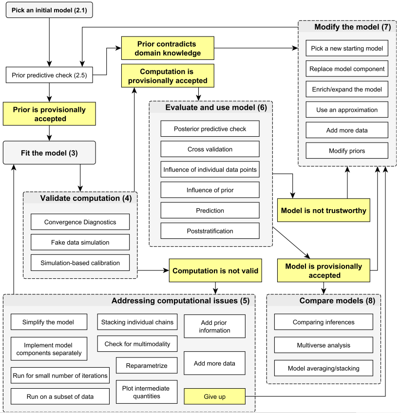
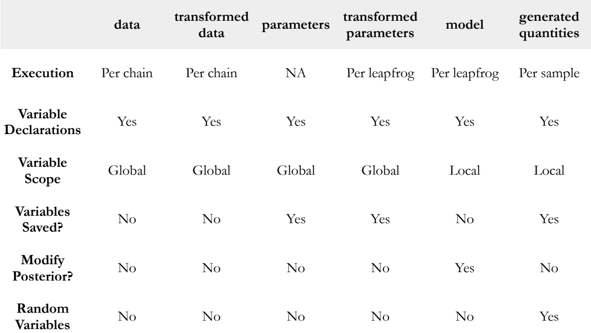

```{r, echo=FALSE, message = FALSE, warning = FALSE}
## --- Options ---
eval_ex <- TRUE
eval_sol <- TRUE
echo_sol <- FALSE
eval_learnr <- TRUE
eval_learnr_sol <- TRUE

knitr::opts_chunk$set(message = FALSE,
                      warning = FALSE)

## --- learnr ---
if ("learnr" %in% (.packages()))
  detach(package:learnr, unload = TRUE)
library(learnr)
```

```{r, echo=FALSE, context="server"}
## --- Options ---
eval_ex <- TRUE
eval_sol <- TRUE
eval_learnr <- TRUE
```

```{r setup, include=FALSE}
knitr::opts_chunk$set(echo = FALSE)

## ---- CRAN Packages ----
## Save package names as a vector of strings
pkgs <-  c("rstan", "rstantools", "coda", "dplyr", "tidyr", "posterior", "devtools")

## Install uninstalled packages
lapply(pkgs[!(pkgs %in% installed.packages())], 
       install.packages,
       repos='https://cran.us.r-project.org')

## Load all packages to library and adjust options
lapply(pkgs, library, character.only = TRUE)

## ---- GitHub Packages ----


## ---- Global learnr Objects ----
load(url("https://github.com/denis-cohen/statmodeling/raw/main/data/lm_stan.RData"))

## ---- rstan Options ----
rstan_options(auto_write = TRUE)             # avoid recompilation of models
options(mc.cores = parallel::detectCores())  # parallelize across all CPUs
```


## Revisiting the Bayesian workflow

### The long version

```{r workflow, echo = FALSE, out.width = '90%', fig.align="center"}

```

<div style="text-align: right"> 
  <sub><sup>
    Source: [Gelman, A., Vehtari, A., Simpson, D., Margossian, C. C., Carpenter, B., Yao, Y., Kennedy, L., Gabry, J., Bürkner, P. C., & Modrák, M. (2020). Bayesian workflow.](https://arxiv.org/abs/2011.01808)
  </sub></sup>
</div>

### Moderately long version

1. **Specification**: Specify the full probability model
    - data
    - likelihood
    - priors
2. **Model Building**: Translate the model into code
3. **Validation**: Validate the model with fake data
4. **Fitting**: Fit the model to actual data
5. **Diagnosis**: Check generic and algorithm-specific diagnostics to assess convergence
6. Posterior Predictive Checks
7. Model Comparison

<div style="text-align: right"> 
  <sub><sup>
    Source: [Jim Savage (2016) A quick-start introduction to Stan for economists. A QuantEcon Notebook.](http://nbviewer.jupyter.org/github/QuantEcon/QuantEcon.notebooks/blob/master/IntroToStan_basics_workflow.ipynb)
  </sub></sup>
</div>


## Specification (linear model)
	
### Example: Linear model

Our knowledge of generalized linear models gives us *almost* everything we need!

### Probability model for the data

First, recall the three parts of the linear model:

* Family: $\mathbf{y} \sim \text{Normal}(\mu, \sigma)$
* (Inverse) link function: $\mu = \text{id}(\eta)$
* Linear component: $\eta = \mathbf{X} \beta$

*Note:* Mimicking the convention in both R and Stan, we parameterize the normal distribution in terms of its mean and *standard deviation* (not variance).

### Known and unknown quantities

* Parameters (unknown, random quantities):
    * $\beta$, the coefficient vector
    * $\sigma$, the scale (variance) parameter of the normal
    * $\eta$, the location (mean) parameter of the normal
* Data (known, fixed quantities):
    * $\mathbf{y}$, the outcome vector
    * $\mathbf{X}$, the design matrix
    * the dimensions of $\mathbf{y}_{N \times 1}$ and $\mathbf{X}_{N \times K}$
    * the dimensions of $\beta_{K \times 1}$, $\sigma$ (a scalar), and $\eta_{N \times 1}$
    
### Priors

What is still missing are prior distributions for the unknown quantities.

Here, we have quite some discretion. There are few rules we must adhere to:

- Our $\beta$'s have unconstrained support (though not all value ranges may be reasonable)
- The scale parameter $\sigma$ cannot be negative

Here, we will opt for a convenience solution and specify weakly informative zero-mean normal priors for the $\beta$'s and a weakly informative half-Cauchy prior for $\sigma$:

- $\beta \sim \text{N}(0, 10)$
- $\sigma \sim \text{Cauchy}^{+}(0, 5)$

```{r prior-viz, fig.align = "center", include = TRUE}
b <- seq(-50, 50, .1)
s <- seq(0, 50, .1)
b_pdf <- dnorm(b, mean = 0, sd = 10)
s_pdf <- dcauchy(s, location = 0, scale = 5)
par(mfrow = c(1, 2))
plot(
  b,
  b_pdf,
  type = 'l',
  xlab = bquote(beta[k]),
  ylab = bquote("p(" ~ beta[k] ~ ")"),
  main = bquote("Prior distribution of " ~ beta[k])
)
polygon(
  c(b, rev(b)),
  c(rep(0, length(b_pdf)), rev(b_pdf)),
  col = adjustcolor("gray50", alpha.f = 0.25),
  border = NA
)
plot(
  s,
  s_pdf,
  type = 'l',
  xlab = bquote(sigma),
  ylab = bquote("p(" ~ sigma ~ ")"),
  main = bquote("Prior distribution of " ~ sigma)
)
polygon(
  c(s, rev(s)),
  c(rep(0, length(s_pdf)), rev(s_pdf)),
  col = adjustcolor("gray50", alpha.f = 0.25),
  border = NA
)
```


## Model building

### Stan Program Blocks

1. Functions: Declare user written functions
2. **Data**: Declare all known quantities
3. Transformed Data: Transform declared data inputs
4. **Parameters**: Declare all unknown quantities
5. Transformed Parameters: Transform declared parameters
6. **Model**: Transform parameters, specify prior distributions and likelihoods
7. Generated Quantities

### Program Blocks

```{r blocks, exercise = FALSE, echo = FALSE, out.width = '72%', fig.align="center"}

```

<br>
<div style="text-align: right">
  <sub><sup>
    Source: http://mlss2014.hiit.fi/mlss_files/2-stan.pdf
  </sub></sup>
</div>

### Script for a Stan program

*Writing scripts for Stan programs*

- Start with a blank script in your preferred code editor and save it as "lm.stan" .
- This will enable syntax highlighting, formatting, and checking in RStudio and Emacs.
- Alternatively, you can save your model as a single character string in R (with some drawbacks).

*Style guide*

- There is a [style guide](https://mc-stan.org/docs/stan-users-guide/style-guide.html). Some recommendations:
    - consistency
    - lines should not exceed 80 characters
    - lowercase variable names, words separated by underscores
    - like R: space around operators: `y ~ normal(...)`, `x = (1 + 2) * 3`
    - use spaces after commas: `y[m, n] ~ normal(0, 1)`
    - use braces even for single-statement blocks
    - use two-space indentation; avoid tabs
- Always make sure to end your script with a blank line.
- You must use a delimiter to finish lines: `;`.
- `// this is a comment`


### Data block

Declare all known quantities, including data types, dimensions, and constraints: 

- $\mathbf{y}_{N \times 1}$
- $\mathbf{X}_{N \times K}$

```{stan ex1-data1, output.var = "none", exercise=TRUE, eval=eval_ex}
data {
  int<lower=1> N; // num. observations
  ... declarations ...
}
```


```{stan ex1-data1-solution, eval=eval_learnr_sol, echo=echo_sol, output.var = "none"}
data {
  int<lower=1> N; // num. observations
  int<lower=1> K; // num. predictors
  matrix[N, K] x; // model matrix
  vector[N] y;    // outcome vector
}
```

### Parameters block

Declare unknown 'base' quantities, including storage types, dimensions, and constraints: 

- $\beta$, the coefficient vector
- $\sigma$, the scale parameter of the normal

```{stan ex1-pars1, output.var = "none", exercise=TRUE, eval=eval_ex}
parameters {
  ... declarations ...
}
```


```{stan ex1-pars1-solution, eval=eval_learnr_sol, echo=echo_sol, output.var = "none"}
parameters {
  vector[K] beta;      // coef vector
  real<lower=0> sigma; // scale parameter
}
```

### Transformed parameters block

Declare and specify unknown transformed quantities, including storage types, dimensions, and constraints: 

- $\eta = \mathbf{X} \beta$, the linear prediction


```{stan ex1-tpars1, output.var = "none", exercise=TRUE, eval=eval_ex}
transformed parameters {
  ... declarations ... statements ....
}
```


```{stan ex1-tpars1-solution, eval=eval_learnr_sol, echo=echo_sol, output.var = "none"}
transformed parameters {
  vector[N] eta;  // declare
  eta = x * beta; // assign
}
```

### Model block

Declare and specify local variables (optional) and specify sampling statements:

- $\beta_k \sim \text{Normal}(0, 10) \text{ for k = 1,...,K}$ 
- $\sigma \sim \text{Cauchy}^{+}(0, 5)$
- $\mathbf{y} \sim \text{Normal}(\eta, \sigma)$

```{stan ex1-mod1, output.var = "none", exercise=TRUE, eval=eval_ex}
model {
  // priors
  ... statements ...
  
  // log-likelihood
  ... statements ...
}
```

```{stan ex1-mod1-solution, eval=eval_learnr_sol, echo=echo_sol, output.var = "none"}
model {
  // priors
  target += normal_lpdf(beta | 0, 10);   // priors for beta
  target += cauchy_lpdf(sigma | 0, 5);   // prior for sigma
  
  // log-likelihood
  target += normal_lpdf(y | eta, sigma); // likelihood
}
```

### Writing Stan programs in R

- You can supply Stan programs as a character string in R
- Downsides:
    - No syntax highlighting, formatting, and checking
    - Must use double quotation marks `"` around the string to avoid that the [transposition operator](https://mc-stan.org/docs/functions-reference/matrix_operations.html#transposition-operator) `'` breaks the string
- Upsides: Works with the interactive `learnr` tutorials in our workshop.

```{r ex1-full, exercise=TRUE, eval=eval_ex, exercise.lines = 30}
# Save as character
lm_code <- 
"data {
  int<lower=1> N; // num. observations
  int<lower=1> K; // num. predictors
  matrix[N, K] x; // design matrix
  vector[N] y;    // outcome vector
}

parameters {
  vector[K] beta;      // coef vector
  real<lower=0> sigma; // scale parameter
}

transformed parameters {
  vector[N] eta;  // declare lin. pred.
  eta = x * beta; // assign lin. pred.
}

model {
  // priors
  target += normal_lpdf(beta | 0, 10);  // priors for beta
  target += cauchy_lpdf(sigma | 0, 5);  // prior for sigma
  
  // log-likelihood
  target += normal_lpdf(y | eta, sigma); // likelihood
}"

# Write to script
writeLines(lm_code, con = "lm.stan")
```

```{r ex1-full-solution, eval=eval_sol, echo=echo_sol, output.var = "none"}
# Save as character
lm_code <- 
"data {
  int<lower=1> N; // num. observations
  int<lower=1> K; // num. predictors
  matrix[N, K] x; // design matrix
  vector[N] y;    // outcome vector
}

parameters {
  vector[K] beta;      // coef vector
  real<lower=0> sigma; // scale parameter
}

transformed parameters {
  vector[N] eta;  // declare lin. pred.
  eta = x * beta; // assign lin. pred.
}

model {
  // priors
  target += normal_lpdf(beta | 0, 10);  // priors for beta
  target += cauchy_lpdf(sigma | 0, 5);  // prior for sigma
  
  // log-likelihood
  target += normal_lpdf(y | eta, sigma); // likelihood
}"

# Write to script
writeLines(lm_code, con = "lm.stan")
```

## Validation

### Simulate the data-generating process in R

```{r inf-sim1, exercise=TRUE, eval=eval_ex, exercise.lines = 20}
# Set seed
set.seed(20210329)

# Simulate data
N <- 1000L                                # num. observations
K <- 5L                                   # num. predictors
x <- cbind(                               # design matrix
  rep(1, N), 
  matrix(rnorm(N * (K - 1)), N, (K - 1))
  )

# Set "true" parameters
beta <- rnorm(K, 0, 1)                    # coef. vector
sigma <- 2.5                              # scale parameter

# Get transformed parameters
eta <- x %*% beta                         # linear prediction

# Simulate outcome variable
y_sim <- rnorm(N, eta, sigma)             # simulated outcome
```

```{r inf-sim1-solution, eval=eval_sol, echo=echo_sol, output.var = "none"}
# Set seed
set.seed(20210329)

# Simulate data
N <- 1000L                                # num. observations
K <- 5L                                   # num. predictors
x <- cbind(                               # design matrix
  rep(1, N), 
  matrix(rnorm(N * (K - 1)), N, (K - 1))
  )

# Set "true" parameters
beta <- rnorm(K, 0, 1)                    # coef. vector
sigma <- 2.5                              # scale parameter

# Get transformed parameters
eta <- x %*% beta                         # linear prediction

# Simulate outcome variable
y_sim <- rnorm(N, eta, sigma)             # simulated outcome
```

### Setup and compilation

```{r inf-setup, exercise=TRUE, eval=eval_ex, exercise.timelimit = 120}
## Setup
library(rstan)
rstan_options(auto_write = TRUE)             # avoid recompilation of models
options(mc.cores = parallel::detectCores())  # parallelize across all CPUs

## Data as list
standat_val <- list(
  N = N,
  K = K,
  x = x,
  y = y_sim
)

## C++ Compilation
lm_mod <- rstan::stan_model(model_code = lm_code)
```

```{r inf-setup-solution, eval=eval_sol, echo=echo_sol, output.var = "none"}
## Setup
library(rstan)
rstan_options(auto_write = TRUE)             # avoid recompilation of models
options(mc.cores = parallel::detectCores())  # parallelize across all CPUs

## Data as list
standat_val <- list(
  N = N,
  K = K,
  x = x,
  y = y_sim
)

## C++ Compilation
lm_mod <- rstan::stan_model(model_code = lm_code)
```

### Estimation

```{r inf-sampl, exercise=TRUE, eval=eval_ex , exercise.lines = 17}
lm_val <- rstan::sampling(
  lm_mod,                     # compiled model
  data = standat_val,             # data input
  algorithm = "NUTS",         # algorithm
  control = list(             # control arguments
    adapt_delta = .85
  ),
  save_warmup = FALSE,        # discard warmup sims
  pars = c("beta", "sigma"),  # select parameters
  iter = 2000L,               # iter per chain
  warmup = 1000L,             # warmup period
  thin = 2L,                  # thinning factor
  chains = 2L,                # num. chains
  cores = 2L,                 # num. cores
  seed = 20210329             # seed
)
```

```{r inf-sampl-solution, eval=eval_sol, echo=echo_sol, output.var = "none"}
lm_val <- rstan::sampling(
  lm_mod,                     # compiled model
  data = standat_val,             # data input
  algorithm = "NUTS",         # algorithm
  control = list(             # control arguments
    adapt_delta = .85
  ),
  save_warmup = FALSE,        # discard warmup sims
  pars = c("beta", "sigma"),  # select parameters
  iter = 2000L,               # iter per chain
  warmup = 1000L,             # warmup period
  thin = 2L,                  # thinning factor
  chains = 2L,                # num. chains
  cores = 2L,                 # num. cores
  seed = 20210329             # seed
)
```

### Output summary

*Reminder:* Here are the 'true' parameter values:

```{r inf-out1, exercise=TRUE, eval=eval_ex}
true_pars <- c(beta, sigma)
names(true_pars) <- c(paste0("beta[", 1:5, "]"), "sigma")
true_pars
```

```{r inf-out1-solution, eval=eval_sol, echo=echo_sol, output.var = "none"}
true_pars <- c(beta, sigma)
names(true_pars) <- c(paste0("beta[", 1:5, "]"), "sigma")
true_pars
```

And here are the estimates from our model:

```{r inf-out2, exercise=TRUE, eval=eval_ex}
lm_val
```

```{r inf-out2-solution, eval=eval_sol, echo=echo_sol, output.var = "none"}
lm_val
```

- When comparing these estimates, the question is, of course, how much deviation should have us worried.
- Deviations from a single validation run may be due to a circumstantial simulation of 'extreme' outcome values when mimicking the data generating process. 
- [Cook, Gelman, and Rubin (2006)](https://www.tandfonline.com/doi/abs/10.1198/106186006X136976) thus recommend running many replications of such validation simulations.
- They also provide a useful test statistic.


### A stanfit object

```{r inf-out3, exercise=TRUE, eval=eval_ex}
str(lm_val)
```

```{r inf-out3-solution, eval=eval_sol, echo=echo_sol, output.var = "none"}
str(lm_val)
```

## Inference

For the sake of illustration, we use the replication data from Bischof and Wagner (2019), made available through the [American Journal of Political Science Dataverse](https://doi.org/10.7910/DVN/DZ1NFG). 

The original analysis uses Ordinary Least Squares estimation to gauge the effect of the assassination of the populist radical right politician Pim Fortuyn prior to the Dutch Parliamentary Election in 2002 on micro-level ideological polarization. 

The outcome variable contains squared distances of respondents' left-right self-placement to the pre-election median self-placement of all respondents. The main predictor is a binary indicator whether the interview was conducted before or after Fortuyn's assassination. 

### Getting actual data

```{r inf-dat, exercise=TRUE, eval=eval_ex, exercise.lines = 30}
## Retrieve and manage data
bw_ajps19 <-
  read.table(
    paste0(
      "https://dataverse.harvard.edu/api/access/datafile/",
      ":persistentId?persistentId=doi:10.7910/DVN/DZ1NFG/LFX4A9"
    ),
    header = TRUE,
    stringsAsFactors = FALSE,
    sep = "\t",
    fill = TRUE
  ) %>% 
  dplyr::select(wave, fortuyn, polarization) %>% ### select relevant variables
  dplyr::filter(wave == 1) %>%                   ### subset to pre-election wave
  tidyr::drop_na()                               ### drop incomplete rows

## Define data
x <- model.matrix(~ fortuyn, data = bw_ajps19)
y <- bw_ajps19$polarization
N <- nrow(x)
K <- ncol(x)

## Collect as list
standat_inf <- list(
  N = N,
  K = K,
  x = x,
  y = y)
```

```{r inf-dat-solution, eval=eval_sol, echo=echo_sol, output.var = "none"}
## Retrieve and manage data
bw_ajps19 <-
  read.table(
    paste0(
      "https://dataverse.harvard.edu/api/access/datafile/",
      ":persistentId?persistentId=doi:10.7910/DVN/DZ1NFG/LFX4A9"
    ),
    header = TRUE,
    stringsAsFactors = FALSE,
    sep = "\t",
    fill = TRUE
  ) %>% 
  dplyr::select(wave, fortuyn, polarization) %>% ### select relevant variables
  dplyr::filter(wave == 1) %>%                   ### subset to pre-election wave
  tidyr::drop_na()                               ### drop incomplete rows

## Define data
x <- model.matrix(~ fortuyn, data = bw_ajps19)
y <- bw_ajps19$polarization
N <- nrow(x)
K <- ncol(x)

## Collect as list
standat_inf <- list(
  N = N,
  K = K,
  x = x,
  y = y)
```

### Inference

```{r inf-real, exercise=TRUE, eval=eval_ex, exercise.lines = 17}
lm_inf <- rstan::sampling(
  lm_mod,                     # compiled model
  data = standat_inf,             # data input
  algorithm = "NUTS",         # algorithm
  control = list(             # control arguments
    adapt_delta = .85
  ),
  save_warmup = FALSE,        # discard warmup sims
  sample_file = NULL,         # no sample file
  diagnostic_file = NULL,     # no diagnostic file
  pars = c("beta", "sigma"),  # select parameters
  iter = 2000L,               # iter per chain
  warmup = 1000L,             # warmup period
  thin = 2L,                  # thinning factor
  chains = 2L,                # num. chains
  cores = 2L,                 # num. cores
  seed = 20210329)            # seed
```

```{r inf-real-solution, eval=eval_sol, echo=echo_sol, output.var = "none"}
lm_inf <- rstan::sampling(
  lm_mod,                     # compiled model
  data = standat_inf,             # data input
  algorithm = "NUTS",         # algorithm
  control = list(             # control arguments
    adapt_delta = .85
  ),
  save_warmup = FALSE,        # discard warmup sims
  sample_file = NULL,         # no sample file
  diagnostic_file = NULL,     # no diagnostic file
  pars = c("beta", "sigma"),  # select parameters
  iter = 2000L,               # iter per chain
  warmup = 1000L,             # warmup period
  thin = 2L,                  # thinning factor
  chains = 2L,                # num. chains
  cores = 2L,                 # num. cores
  seed = 20210329)            # seed
```

### Posterior summaries

The original analysis reports point estimates (standard errors) of 1.644 (0.036) for the intercept and -0.112 (0.076) for the before-/after indicator.

How do our estimates compare?

#### Model summary

```{r inf-sum, exercise=TRUE, eval=eval_ex}
print(lm_inf,
      pars = c("beta", "sigma"),
      digits_summary = 3L)
```

```{r inf-sum-solution, eval=eval_sol, echo=echo_sol, output.var = "none"}
print(lm_inf,
      pars = c("beta", "sigma"),
      digits_summary = 3L)
```

#### Hypothesis testing

```{r inf-prob, exercise=TRUE, eval=eval_ex}
# Extract posterior samples for beta[2]
beta2_posterior <- posterior::as_draws_df(lm_inf)$`beta[2]`

# Probability that beta[2] is greater than zero
mean(beta2_posterior > 0)
```

```{r inf-prob-solution, eval=eval_sol, echo=echo_sol, output.var = "none"}
# Extract posterior samples for beta[2]
beta2_posterior <- posterior::as_draws_df(lm_inf)$`beta[2]`

# Probability that beta[2] is greater than zero
mean(beta2_posterior > 0)
```

## Convergence diagnostics

### Generic diagnostics: `Rhat` and `n_eff`

1. $\hat{R} < 1.05$: Rank-normalized split-$\hat{R}$ convergence diagnostic
    - values close to 1 indicate that chains are stationary and mix well
    - values above 1.05 suggest that chains have not yet converged adequately to the same target distribution
1. $\mathtt{ESS}_{\text{bulk}}, \mathtt{ESS}_{\text{tail}} > 100 \times m$: Effective sample size
    - a small effective sample size indicates high autocorrelation within chains
    - this indicates that chains explore the posterior density slowly and inefficiently
    - bulk ESS matters for central posterior summaries
    - tail ESS matters for posterior intervals and tail summaries

### Algorithm-specific diagnostics

In the words of the developers:

<blockquote>
"Hamiltonian Monte Carlo provides not only state-of-the-art sampling speed, it also provides state-of-the-art diagnostics. Unlike other algorithms, when Hamiltonian Monte Carlo fails it fails sufficiently spectacularly that we can easily identify the problems."
</blockquote>

<div style="text-align: right"> 
  <sub><sup>
    Source: https://github.com/stan-dev/stan/wiki/Stan-Best-Practices 
  </sub></sup>
</div>

- Divergent transitions after warmup (validity concern)
    - the sampler is struggling with the posterior geometry
    - first, consider reparameterizing the model
    - use more informative priors if appropriate
    - increase `adapt_delta` if needed
- Maximum treedepth exceeded (usually an efficiency concern)
    - the sampler is taking unusually long trajectories through the posterior
    - this may indicate inefficient exploration or difficult geometry
    - first, consider reparameterizing the model
    - increase `max_treedepth` if needed
- Low Bayesian fraction of missing information, BFMI (efficiency concern)
    - this suggests that Hamiltonian Monte Carlo is not exploring the momentum distribution efficiently
    - rescaling parameters, reparameterizing the model, or improving priors may help
- For further information, see the [Stan diagnostics and warnings guide](https://mc-stan.org/learn-stan/diagnostics-warnings.html)


### Print summaries of algorithm-specific diagnostics

As with `brmsfit` objects, we can use the following utility function on `stanfit` objects to perform all diagnostic checks at once:

```{r all-checks, echo=TRUE}
rstan::check_hmc_diagnostics(lm_inf)
```

### Visual diagnostics using **bayesplot**

**bayesplot** offers a vast selection of visual diagnostics for `stanfit` objects:

- Diagnostics for No-U-Turn-Sampler (NUTS) 
    - Divergent transitions
    - Energy
    - Bayesian fraction of missing information
- Generic MCMC diagnostics
   - $\hat{R}$
   - $\mathtt{n_{eff}}$
   - Autocorrelation
   - Mixing (trace plots)

For full functionality, examples, and vignettes:

- [GitHub Examples](https://github.com/stan-dev/bayesplot)
- [CRAN Vignettes](https://cran.r-project.org/web/packages/bayesplot/vignettes/visual-mcmc-diagnostics.html)
- `available_mcmc()` function

### Example: Trace plot for sigma

```{r bayesplot, exercise = FALSE, eval = TRUE, echo = TRUE, message = FALSE, warning = FALSE, fig.align = "center", out.width='50%'}
# Extract posterior draws from stanfit object
lm_post_draws <- posterior::as_draws_array(lm_inf)

# Traceplot
bayesplot::mcmc_trace(lm_post_draws, pars = c("sigma"))
```
